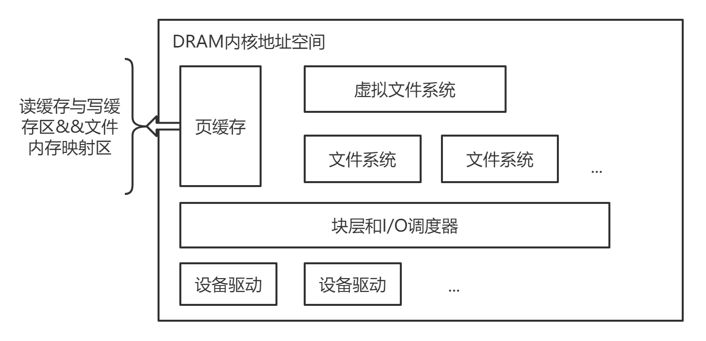

# Rethinking File Mapping for PM

PM有两种用途，一种是将PM作为大型内存，这时将DRAM作为缓存来使用；

另一种是将PM作为持久性磁盘，本论文就是讨论将PM作为持久性磁盘时，优化磁盘文件系统的方法。

## 文件系统在内存上表现为

现在已经存在好几个性能优良的PM文件系统，如何在此基础上优化这类文件系统的性能呢？作者关注到一个很特别但被大家忽视的点，就是页缓存和文件映射，本论文的主要工作是：提倡取消页缓存和更换文件映射的数据结构。《现代操作系统》中提到的以下两点不适合使用页缓存的场景：

（1）部分应用对数据持久化有较强的要求，不希望文件的修改内容缓存在页缓存中；

（2）部分应用程序（如数据库等）会自己实现缓存机制对数据进行缓存和管理。

PM是持久性的设备，应该和以上两点有关吧。论文中根据前人的测试得出，在持久性内存上不使用页缓存会得到更好的性能。

## 磁盘上的文件系统

应用程序对磁盘进行读写时，内核通过虚拟文件系统和 fd 找到 文件inode和逻辑块，然后通过文件映射找到物理块的起始位置，最后通过偏移量找到SSD的物理块（若没有分配物理块，则通过Block allocator 分配物理块）。

## PM上的文件系统

**经过优化后，PM的文件系统结构为：**

作者对strata文件系统，进行四种优化：

（1）采用Extent Tree实现文件映射

通过不断的二分搜索查找物理块，最后找到叶结点，其映射为三元组：<logical block start: physical block start (number of blocks)>；【应该是将inode需要的逻辑块个数融入了number of blocks 中了】

缺点：由于extent tree的结构，逻辑块的插入和删除可能需要调整树（插入，可能要向下调整；删除，可能要向上调整）  

（2）采用Radix Tree实现文件映射

通过字节的个数决定逻辑块的层数，字节的内容决定逻辑块属于哪个结点，叶结点决定逻辑块对应的物理块；

缺点：不知道

（3）采用Cuckoo Hash Table实现文件映射

Cuckoo根据File Number和Logical Block生成两个不同的哈希函数进行映射，每个映射都得到两个存储位置（并永久记录下来），若此时第一个存储位置为空，就把映射存在此处；若第一个存储位置已经有数据，而第二个存储位置为空，则把映射存在此处；若第一、第二个存储位置都有数据，就把第二个位置的数据踢掉，把映射存在此处。（被踢的数据，根据记录找到它的第二个存储位置并进行存储；若不幸第二个位置也被占了，则继续踢；这时会出现不断"踢"的现象，效率大打折扣）

映射为四元组：<inum>, <logical block>: <physical block>(<# of blocks>)

（4）块分配器和文件映射采用HashFS

HashFS根据File Number和Logical Block生成一个哈希函数，对应的物理块位置是根据元数据区域中条目的偏移量计算出来的。例如，如果<inum=1, lblk=21>的散列解析为元数据区域中的偏移量 i（偏移量与哈希表索引相同），相应的物理块的位置是(fileDataStart + i × blockSize)， blockSize = 4KB；

但出现冲突的话，其花销也很大，尤其是文件系统存储得很满的时候。

